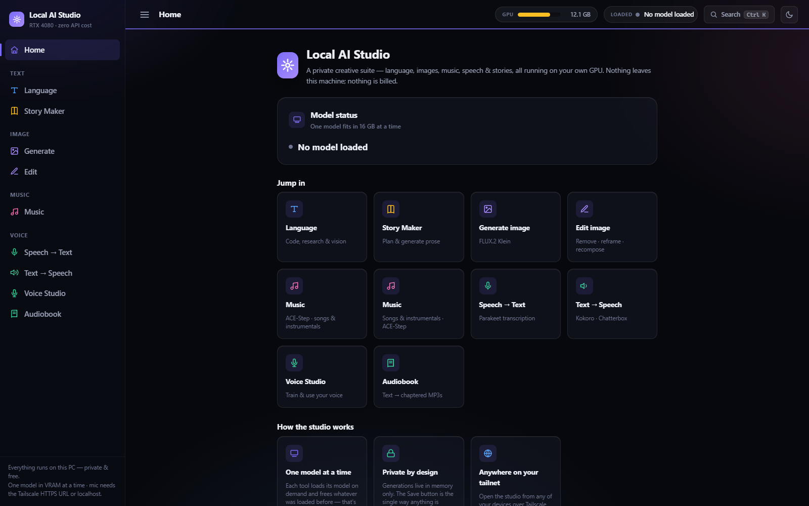
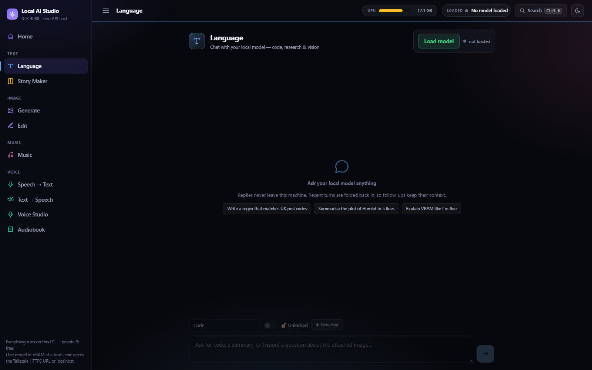
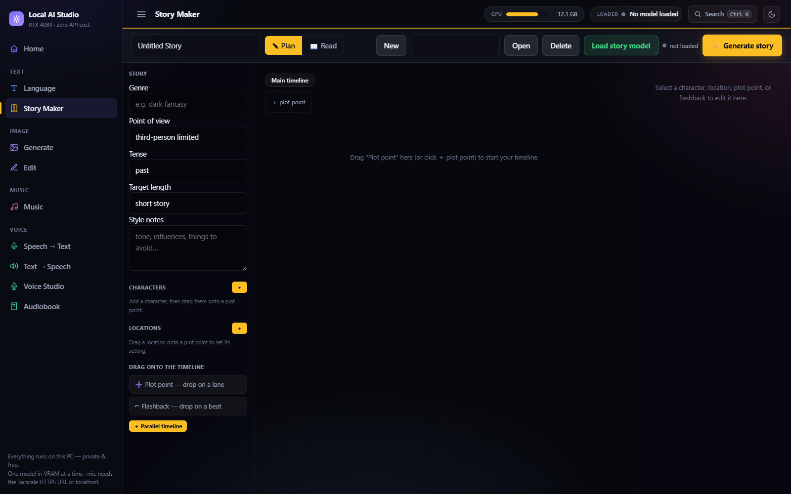
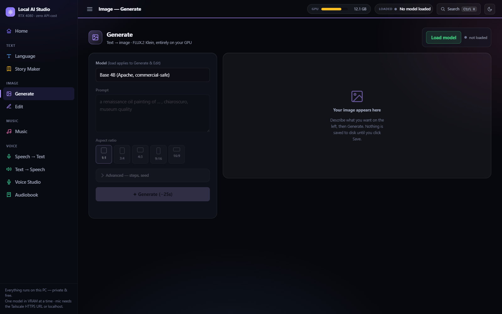
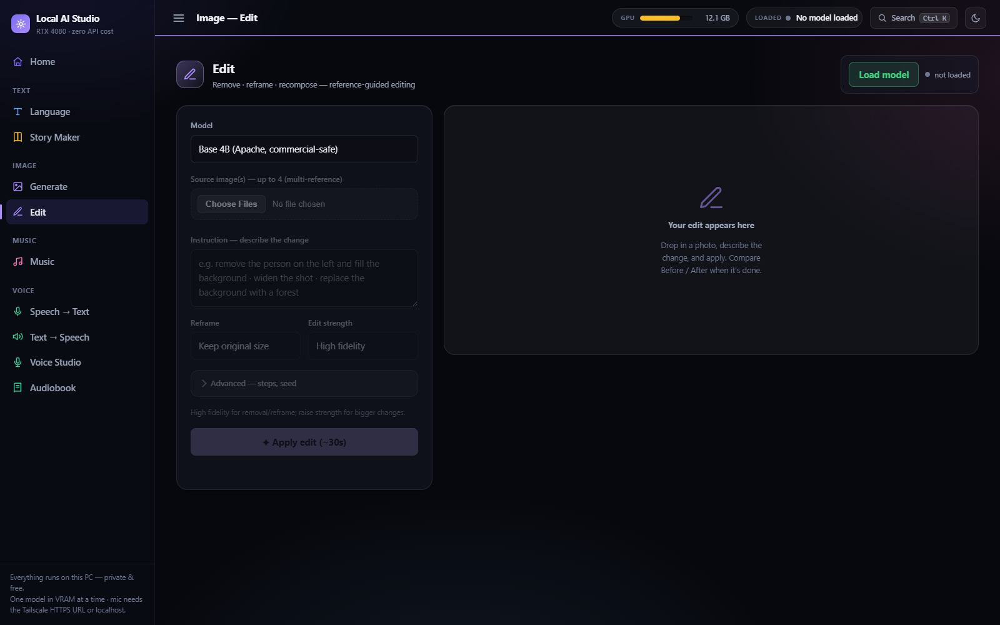
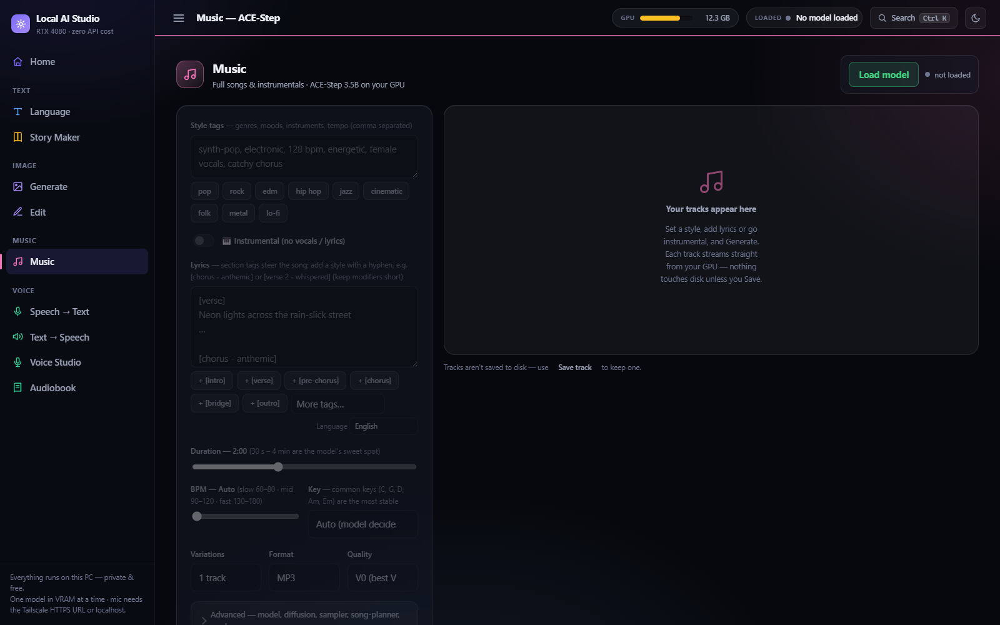
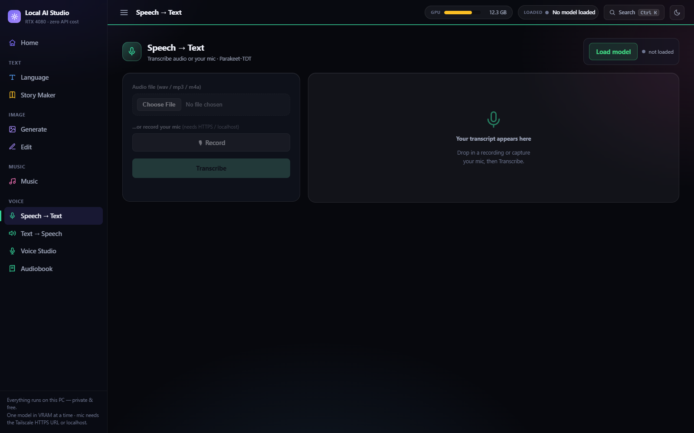
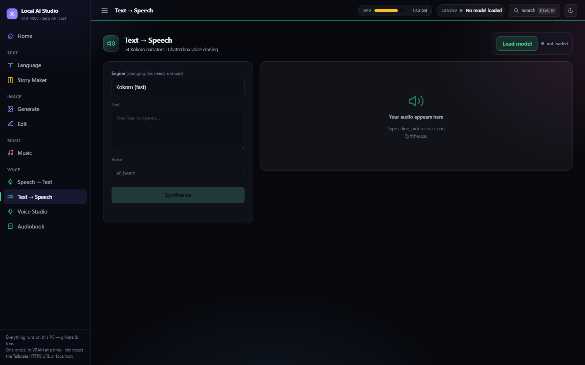
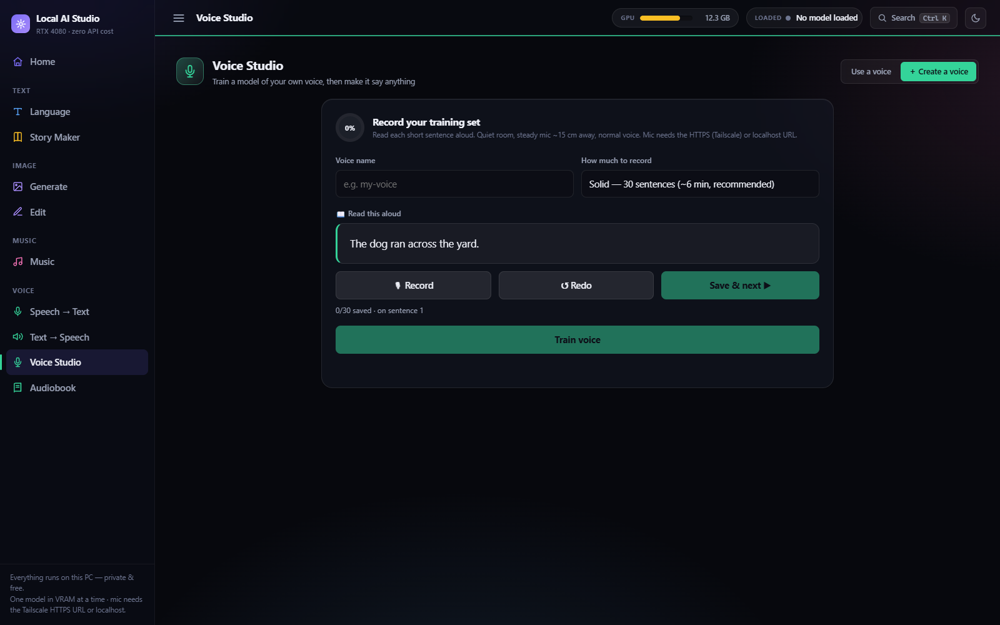
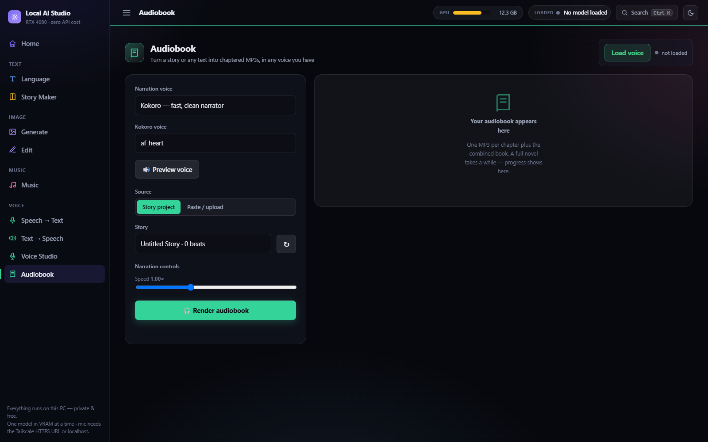

# Local AI Studio

**A private, local, zero-API-cost AI workstation — language, image, music, speech, and voice models, all running on your own GPU, in one browser tab.**

> No API keys. No subscriptions. No data leaving your machine. Just your GPU and a browser at `http://127.0.0.1:8800`.

---

## Introduction

Local AI Studio is a self-hosted creative workstation that brings together large-language, image, music, speech-to-text, text-to-speech, and voice-cloning models behind a single tabbed web app — all running locally on an NVIDIA GPU, with nothing billed and nothing sent to the cloud.

It didn't start out this ambitious. The project began as a much smaller problem: I wanted **Claude to be able to call on local models to help build a graphic novel** — generating reference art, iterating on panels, and keeping the whole pipeline private and free to run as many times as I wanted. That meant giving Claude a reliable way to talk to an image model running on my own hardware.

Once that worked, it was hard to stop. A local LLM followed, then text-to-speech and voice cloning for narrating scripts, then music generation for soundtracking scenes, then speech-to-text for turning spoken notes back into text, then a proper multi-scene **Story Maker** for long-form fiction, and an **Audiobook** pipeline to turn any of it into chaptered narration. Somewhere along the way it stopped being "a tool that helps Claude make a graphic novel" and became a full **studio** — with its own UI, its own control panel, and its own setup runbook so it can be rebuilt on a fresh machine in one pass.

That's still the spirit of the project: give an AI (or yourself) a local set of creative tools with no per-call cost, no rate limits, and no vendor lock-in — you own the weights, the pipeline, and the output.

---

## Features

| Tab | What it does | Backend |
|---|---|---|
| 🧠 **Language** | Code / research / vision prompts to a local LLM, with a 🔓 Unlocked (uncensored) option | Ollama |
| 🎨 **Image — Generate** | Text → image (FLUX.2 Klein) | ComfyUI |
| ✂️ **Image — Edit** | Reference-guided edit / remove / reframe / outpaint | ComfyUI |
| 🎵 **Music** | Full songs & instrumentals from style tags + lyrics (ACE-Step 1.5 XL) — structure/vocal/energy lyric tags, BPM/Key/time-signature control, remix mode | ComfyUI |
| 🎙️ **Speech → Text** | Transcribe audio | NeMo Parakeet |
| 🔊 **Text → Speech** | Fast narration (Kokoro) and voice cloning (Chatterbox) | conda envs |
| 🗣️ **Voice Studio** | Fine-tune & reuse a personal voice | XTTS-v2 |
| 📖 **Story Maker** | Timeline-driven multi-scene story / novel generation | koboldcpp (Cydonia-24B) / Ollama |
| 📚 **Audiobook** | Story project or pasted text → chaptered MP3s with natural pacing and loudness normalization | TTS worker + ffmpeg |

Plus a CLI (`studioctl.ps1`) and a visual control panel (`studio_gui.pyw`, with a one-click Desktop shortcut) to start, stop, and monitor the whole stack — Ollama, ComfyUI, and the studio server — from one place.

---

## Screenshots

| | |
|---|---|
| **Home**  | **Language**  |
| **Story Maker**  | **Image — Generate**  |
| **Image — Edit**  | **Music — ACE-Step**  |
| **Speech → Text**  | **Text → Speech**  |
| **Voice Studio — create a voice**  | **Audiobook**  |

---

## Why local?

- **Zero API cost.** Every generation — image, music, voice, chat — runs on hardware you already own. Iterate as many times as you want.
- **Private by default.** Nothing leaves the machine. No prompts, no generated art, no audio ever touches a third-party server.
- **One heavy model at a time, by design.** The studio is built around a single consumer GPU — it loads what you're using and frees it when you switch tabs, rather than assuming a data-center's worth of VRAM.
- **No vendor lock-in.** Swap the underlying model for any tab without touching the rest of the app.

---

## Requirements

- **OS:** Windows 10/11
- **GPU:** NVIDIA, current driver — **~16 GB VRAM** is the design target
- **Disk:** ~90 GB free for the required model set (~110 GB with the optional uncensored image model and unlocked LLM)

---

## Getting started

The entire install is captured in a single, self-contained runbook — **[`SETUP_FOR_CLAUDE.md`](SETUP_FOR_CLAUDE.md)** — designed to be handed to Claude Code (or followed by hand) on a fresh machine. It carries the full source of every component embedded inline, so nothing needs to be fetched from a separate repo to bootstrap the app itself.

1. Give `SETUP_FOR_CLAUDE.md` to Claude Code, or work through its phases manually:
   - **Phase 0–1:** detect and install prerequisites (Miniconda, Ollama, ffmpeg, git)
   - **Phase 2:** write the application source files
   - **Phase 3:** create the conda environments for the audio/voice workers
   - **Phase 4:** set up the ComfyUI headless runtime
   - **Phase 5:** download the required models
   - **Phase 6:** launch, smoke-test every tab, and create the Desktop shortcut
   - **Phase 7:** optional remote access over Tailscale, and shutdown
2. Open **http://127.0.0.1:8800** and start generating.

For a deeper dive, see the companion docs in [`/docs`](docs/):
- **Technical Overview** — architecture, feature tour
- **Technical Reference** — API/endpoint-level detail
- **Install and Troubleshooting** — setup issues and fixes

---

## Architecture at a glance

A single Python stdlib HTTP server (`server.py`) serves the UI (`index.html`) and brokers every request to a backend:

- **Ollama** — local LLM / vision
- **ComfyUI** (headless git checkout) — image generation/edit and music
- **Conda-env worker subprocesses** — speech-to-text, text-to-speech, and voice cloning, each in its own isolated environment (their torch/transformers/setuptools requirements conflict and can't share one env)
- **koboldcpp** — long-form fiction backend for Story Maker, launched on demand

The whole stack is controlled from `studioctl.ps1` (CLI) or `studio_gui.pyw` (visual control panel), which start, stop, and health-check every service.

---

## Credits & licensing

Local AI Studio is glue code and a UI around excellent open-weight models and tools built by other people:

- **Ollama**, **ComfyUI**, **koboldcpp**
- **FLUX.2 Klein** (Black Forest Labs) — image generation
- **ACE-Step 1.5** — music generation
- **NeMo Parakeet-TDT** (NVIDIA) — speech-to-text
- **Kokoro** — fast narration TTS
- **Chatterbox** (Resemble AI) — voice cloning
- **XTTS-v2** (Coqui) — voice fine-tuning — *non-commercial, Coqui CPML: personal/artistic use only*
- **Cydonia** (TheDrummer) — long-form fiction model

Check each model's own license before any commercial use — several of the above are personal/research use only. This project itself adds no additional restriction beyond what each model's license already requires.

---

## Roadmap / known limitations

- Windows-only for now (the control tools and conda paths assume Windows).
- Single-GPU, single-model-loaded-at-a-time by design — not built for concurrent heavy workloads.
- Some tabs (Unlocked LLM, uncensored image model) are optional and require separately fetching gated/uncensored model weights.
